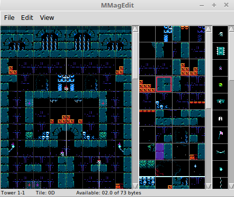

 # MMagEdit
 
[](https://ci.appveyor.com/project/nstbayless/mmagedit)
 
*A cross-platform ROM editor and library for [Micro Mages](http://morphcat.de/micromages/).*
 
This utility can edit levels, worlds, and tile information for Micro Mages (by [Morphcat games](http://morphcat.de/)), and it can extend the game's basic features with new elements, such as more complex level data. Made with Python3, `Pillow`, and `tkinter`. Has both a GUI and CLI.

MMagEdit is also available as a **[shared library](#shared-library) (.so, .dylib, or .dll)** so that other projects can use MMagEdit's back-end to create hacks for Micro Mages, even if they aren't written in python. C, C++, C#, Unity, Lua, or any other language that can link to a shared library should all be supported. If compiled with [emscripten](https://emscripten.org/), it can even run in the browser.

**Windows**: [Download](https://ci.appveyor.com/api/projects/nstbayless/mmagedit/artifacts/mmagedit.zip).
*Note: Appveyor deletes builds after 1 month. If this link doesnt work, please ping NaOH on discord to manually rebuild. We will migrate to github for builds soon, which will solve this problem.*

**Linux**: See "Launching (Ubuntu)" below.

<center></center>

## Shared Library

You can build [mmagedit.cpp](./libmmagedit/mmagedit.cpp) as a shared library. To do so, you must compile the cpp file and link it to libpython35 or higher. Documentation for the library interface can be found in [mmagedit.h](./libmmagedit/mmagedit.h). A pre-compiled linux SO can be found [here](https://github.com/nstbayless/mmagedit/releases/tag/v1.25-lib).

Here's a simple example of usage:

```C++
// The .py files in this repository are required
mmagedit_init("/path/to/mmagedit.py");

// Check for errors
// (This should be done after every library call,
// but is omitted hereafter for clarity.)
if (mmagedit_get_error_occurred())
{
    printf("%s", mmagedit_get_error());
    exit(1);
}

// A micro mages ROM is necessary.
mmagedit_load_rom("/path/to/micromages.nes");

// dump the entire state of the ROM to JSON
const char* json_state = mmagedit_get_state();

// select individual elements of the ROM state
const char* objects_in_tower_2_1 = mmagedit_get_state_select(".levels[3].objects");

// remove all objects from level 2
mmagedit_apply_state("{\"levels\": [{}, {\"objects\": []}]}");

// export modified ROM
mmagedit_write_rom("/path/to/modified_micromages.nes");

// shutdown
mmagedit_end();
```

## GUI Usage

### Lag

Please be aware that some functionality is a bit laggy in the GUI. Most prominently, **changing the zoom level**
and **closing a subwindow** are likely to incur quite a lot of lag. Optimizations for this may be figured out in the future,
but in the meantime please bear with it.

Users have also reported that some lag may occur for a few minutes while the program first loads, but will go away afterward.

### Placing Stage Elements

Left-clicking, middle-clicking (or ctrl-clicking), shift-clicking, and right-clicking all achieve different effects:

- Left Click: places a tile, tile patch, or object
- Right Click: removes a tile, tile patch, or object
- Middle Click / Ctrl Click: edits the mirror position (seam position). Not available on hard mode.
- Shift Click: drag to select a rectangle (for copying/cutting/deleting/pasting)

## Launching (Ubuntu)

To launch with python3 on Ubuntu Linux, first make sure the dependencies are met:

```
sudo apt-get install python3-tk python3-pil.imagetk
sudo python3 -m pip install pillow
```

Simply run `mmagedit.py` in python:

```
python3 mmagedit.py
```

## CLI Usage

The CLI for MMagEdit allows MMagEdit to be used as a step of a romhack build process, or just for users
who prefer using the command line to a graphical editor.

The following arguments can be passed to `mmagedit.py` from the command line:

```
python3 mmagedit.py [base.nes] [args...]

--help: shows summary of options available
-i hack.txt: applies hack.txt to model
-o hack.txt: saves model to hack.txt
-e modified.nes: exports model to ROM
-p patch.ips: exports model to IPS patch
--export-images: exports model as image sheet (one for each stage normal/hard)
```

At least one of `-o`, `-e`, `-p`, or `--export-images` must
be used to suppress the GUI.

### Examples

To export a `hack.txt` file to a NES ROM (this is the most common usage):

```
python3 mmagedit.py base.nes -i hack.txt -e modified.nes
```

To create a hack.txt file to begin with:

```
python3 mmagedit.py base.nes -o hack.txt
```

### Text-Only features

Some capabilities of MMagEdit are limited to the text file simply because they have not yet been added to the GUI. This is a non-exhaustive list.

- Editing text
- Editing music
- Adjusting object stats (hp, etc.)
- Editing chest loot drop rates
- Editing the title screen
- Adjusting world palette colours
- Adjusting the world med-tile self-symmetry index

To edit any of these aspects of the hack, please open the hack text file directly in a text editor such as notepad.

## TODO

- selection:
    - checkboxes to select what layers to copy/paste to/from
    - macro-patch copy/pasting
- export single image
- mod to make game over respawn from start of level instead of world
- GUI string editor
- objects with normal/hard/hell flags
- adjust level size?
- adjust level direction/orientation?
